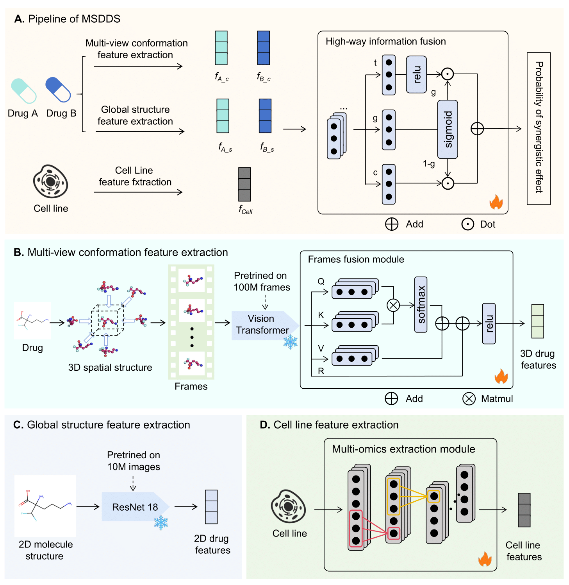

# MSDDS



## File Descriptions

* **cell/**: Contains multi-omics data of cell lines
* **ckpts/**: Stores pre-trained model weights
* **drugcomb/**: A dataset directory
* **drugcombdb/**: Another dataset directory
* **dataprocess.py**: Implements data preprocessing
* **main.py**: Manages model training and prediction
* **dataset.py**: Loads the datasets
* **model_h.py**: Contains the model implementation
* **utils.py**: Implements model evaluation methods and result saving

## Installation

```
conda create -n MSDDS python==3.9
conda activate MSDDS
pip install torch==2.5.1 torchvision==0.20.1 torchaudio==2.5.1 --index-url https://download.pytorch.org/whl/cu121
pip install rdkit prettytable sympy  opencv-python  pandas matplotlib timm  scikit-learn
```


## Usage

Preprocess the data to generate images of drugs. ( Pymol needs to be installed, you can get it for free from the [link]([PyMOL | pymol.org](https://pymol.org/)) )

`python datasetprocess.py --data drugcomb `

Train the model

`python main.py --dataset_name drugcomb --split_way random`